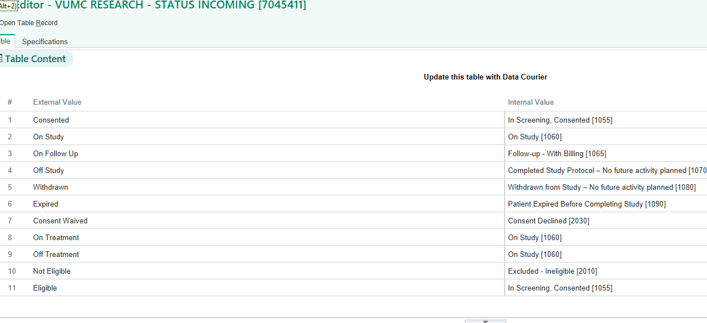

# Redcap Epic Participant Updater

External module to collect data from EPIC and update/create records on redcap

####Enrollment Status Codes


### Install dependencies
Install dependencies with `Composer`.

```bash
$ composer install
```